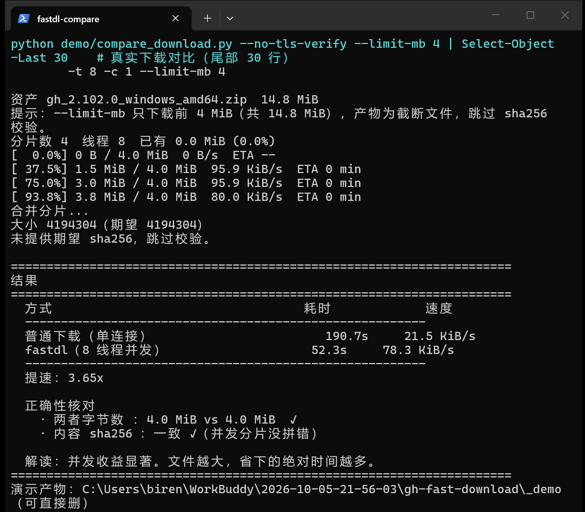

# gh-fast-download


[](https://github.com/joker1point/gh-fast-download/releases/latest)
[](https://github.com/joker1point/gh-fast-download/actions/workflows/ci.yml)

> **单连接下载大文件被限速到几十 KB/s？用多连接把它拉满。**
> 单文件 Python 脚本，零依赖，复制即用。附断点续传与 sha256 校验。

```bash
# 不需要 clone，直接下附件就能用
curl -LO https://github.com/joker1point/gh-fast-download/releases/latest/download/fastdl.py
python fastdl.py <URL>
```

<p align="center">
  <br>
  <sub>真实运行截图（<code>demo/compare_download.py --limit-mb 4</code>）：两种方式各下相同 4 MiB，实测提速 <b>3.65×</b>，
  并逐字节核对 sha256。提速取决于你的链路是否被限速 —— 跑出接近 1× 时脚本会如实说明。</sub>
</p>

📋 [更新日志](CHANGELOG.md) · 🐛 [反馈问题](https://github.com/joker1point/gh-fast-download/issues) · 📄 [贡献指南](CONTRIBUTING.md) · 📊 [项目演示](https://my.feishu.cn/docx/YbUtdQ0XMoIGcHxdoyFciGJxnnf)

---

## 一、它解决什么问题

下载GitHub Release 上的大文件（模型权重、便携版、数据集），单连接常常只有 **50 KB/s**，
一个 600MB 的包要下3 小时。原因是服务端/CDN 对**单连接**限速。

这个脚本把文件切成 N 块，**开N 个线程各拉一块**，带宽利用率成倍上升。

实测（详见下方「实测数据」）：单连接 55 KB/s → 16 线程 0.41 MB/s，**提升 7.6 倍**。

### 不是什么

- **不是**代理工具 / VPN，不改变你的网络出口
- **不是**镜像加速，不依赖任何第三方加速服务
- **不是**断网续传神器 —— 它能**进程级**续传（中断重跑），但不跨机器

---

## 二、快速开始

零依赖，Python 3.8+ 直接跑。**不需要 clone，也不需要装 gh、不需要 token**
（只有私有仓库才需要认证）：

```bash
# 1) 拿到脚本（永远指向最新版）
curl -LO https://github.com/joker1point/gh-fast-download/releases/latest/download/fastdl.py
```

然后从 GitHub 下载大文件，只需知道三样东西：`owner/repo`、`tag`、资产名。

```bash
# 2) 不确定资产名叫什么？先列出来看看
python fastdl.py --gh-release cli/cli --tag v2.102.0 --list-assets
# cli/cli @ v2.102.0  共 22 个资产
#   gh_2.102.0_linux_amd64.tar.gz     14.6 MiB  sha256
#   ...

# 3) 下载（自动读取大小与官方 sha256，下完自动校验）
python fastdl.py --gh-release cli/cli --tag v2.102.0 --asset gh_2.102.0_linux_amd64.tar.gz
```

### owner / tag / asset 从哪来？

打开该项目的 **Releases 页面**，对着地址栏看就明白了：

```
https://github.com/cli/cli/releases/tag/v2.102.0
                  └───┬──┘         └──┬───┘
                  owner/repo        tag
```

资产名用上面的 `--list-assets` 查最快，或直接在页面 Assets 列表里看。

> 直接把 release 页面地址粘给工具也行——它会告诉你该改成哪条命令，
> 不会抛一堆看不懂的错。同理，只记得仓库地址也可以。

### 其他常见用法

```bash
# 一个 release 只有一个资产时可省略 --asset
python fastdl.py --gh-release owner/repo --tag v1.0.0

# 任意直链（从浏览器复制到的真实下载地址）
python fastdl.py https://example.com/bigfile.tar.gz -o out.tar.gz

# 大文件想更快：调线程数和分片大小
python fastdl.py https://example.com/bigfile.tar.gz -t 32 -c 8

# 私有仓库：推荐用 gh auth login，而不是 --token
```

Windows 上如果报证书错误，加 `--no-tls-verify`（原因见下方「踩过的坑」）。

### 校验下载的脚本

[每个 release](https://github.com/joker1point/gh-fast-download/releases/latest) 都附带 `SHA256SUMS`。
**在存放 `fastdl.py` 的目录里运行**：

```bash
curl -LO https://github.com/joker1point/gh-fast-download/releases/latest/download/SHA256SUMS

# --ignore-missing：只校验你实际下载了的文件
# （SHA256SUMS 同时列了 fastdl.py 和 selftest.py，不加此参数会因缺文件报错）
sha256sum -c SHA256SUMS --ignore-missing
# fastdl.py: OK
```

macOS 上把 `sha256sum` 换成 `shasum -a 256`。

> 若输出 `no file was verified` 且退出码为 1，说明当前目录里没有可校验的文件
> ——先确认 `fastdl.py` 已下载到此处。

### 想自己复验行为？附件里带了测试

每个 release 也附带 `test_offline.py`（28 个离线测试，**不触网**），
可以在本地独立验证代码行为，而不必相信文档描述：

```bash
BASE=https://github.com/joker1point/gh-fast-download/releases/latest/download
curl -LO $BASE/fastdl.py -LO $BASE/test_offline.py -LO $BASE/SHA256SUMS
sha256sum -c SHA256SUMS --ignore-missing
python test_offline.py
# Ran 28 tests ... OK
```

> **自举小技巧**：本工具也能下载自己。后续版本可以这样更新：
> ```bash
> python fastdl.py --gh-release joker1point/gh-fast-download --tag v1.0.1 --asset fastdl.py
> ```

---

## 三、用法速查

| 参数 | 说明 | 默认 |
|---|---|---|
| `<URL>` | 下载地址（与 `--gh-release` 二选一） | — |
| `--gh-release OWNER/REPO` | 从 release 下载，自动取 size与官方 sha256 | — |
| `--tag TAG` | release 的 tag，配合上面使用 | — |
| `--asset NAME` | 资产名（一个 release 有多个资产时必填） | 唯一资产 |
| `--list-assets` | 只列出该 release 的资产，不下载 | 关 |
| `--limit-mb N` | 只下载前 N MiB（试水/测速）；产物截断，跳过校验 | 不限制 |
| `-o, --out PATH` | 输出路径 | URL 末段 |
| `-t, --threads N` | 并发线程数 | `16` |
| `-c, --chunk-mb N` | 分片大小（MiB） | `8` |
| `--sha256 HEX` | 期望的 sha256，用于校验 | 无 |
| `--tokenTOKEN` | 私有仓库 token，也可用 `GITHUB_TOKEN` | — |
| `--no-tls-verify` | 关闭证书校验（Windows schannel 修复） | 关 |
| `--use-proxy` | 走系统代理 | 直连 |
| `-k, --keep-parts` | 完成后保留分片 | 删 |

### ⚠️ 别在小文件上开高并发

分片数 = `文件大小 ÷ 分片大小`。参数不是越高越好：

| 文件大小 | 建议 |
|---|---|
| < 20 MB | 用默认值即可，甚至 `-t 4`；高并发纯属浪费 |
| 20 MB ~ 500 MB | 默认 `-t 16 -c 8` |
| > 500 MB | 可试 `-t 32 -c 8` |

实测：2.9 MB 文件配 `-t 32 -c 4` 会切成 32 个 4 MB 分片，
但文件只有 2.9 MB——绝大多数分片是空请求，时间全耗在
32 次 TLS 握手和 CDN 限流上。**并发收益来自传输时间，不是请求数量。**

注意一个连带影响：**分片大小也决定了最小有意义样本**。
默认 `-c 8`（8 MiB）时，一个 4 MiB 的文件只会切出 **1 片**，
等于单连接——并发无从体现。想在小文件上看到加速，请同时调小分片：

```bash
python fastdl.py <URL> -c 1 -t 8      # 1 MiB 分片，小文件也能切成多片
```

### 先试水再决定：`--limit-mb`

文件很大、不确定值不值得下？先拉几 MB 看看速度：

```bash
# 只下前 5 MiB，看看这条链路到底多快
python fastdl.py --gh-release owner/repo --tag v1.0.0 --asset big.zip --limit-mb 5
```

产物是**截断文件**，因此会跳过 sha256 校验（官方 digest 对不上是正常的）。

### 中途断了怎么办

**重跑同一条命令**即可。已下载的分片会跳过，只补缺失部分：

```
分片数 9  线程 16  已有 9.0 MiB (54.3%)   ← 续传起点
[ 54.3%] ...
校验通过 ✓
```

### 不确定该不该用多线程？先自检

```bash
# 推荐：传一个 20 MB 以上的直链，才能测出真实吞吐
python selftest.py https://github.com/<owner>/<repo>/releases/download/<tag>/<大文件>

# 不传参数只做 TLS 连通性探测
python selftest.py
```

会实测单连接 vs 8 连接并给出建议线程数。

> **为什么不传 URL 时不做测速？** 默认目标是本项目自己的 release 资产（约 18 KB），
> 样本太小，耗时几乎全落在 TLS 握手与 RTT 上，据此得出的并发结论会失真。
> 与其给一个误导性结论，不如直接告诉你换个大的文件来测。
> 测吞吐**必须**有足够大的样本，这也是下面这条注意事项的由来。

> ⚠️ 小心解读：CDN 会对同一 IP 的**高频 Range 请求**限流。
> 若测出「并发反而更慢」，通常是对自己的源站打太密了，
> 试着调低并发 `-t 4` 或加大分片 `-c 32`，让每个连接传输更久、
> 更接近正常浏览行为。**大文件才有明显收益**，几 MB 的小文件直接单连接下更快。

---

## 四、实测数据

2026-10 于中国大陆 Windows 环境，下载 623MB 文件：

| 方式 | 速度 | 623 MB 耗时 |
|---|---|---|
| curl 单连接（走本机代理） | 19 KB/s | ~9 小时 |
| curl 单连接（直连） | 55 KB/s | ~3.2 小时 |
| **fastdl 16 线程直连** | **0.41 MB/s** | **约 25 分钟** |

两个值得注意的发现：

1. **本机代理反而是负优化** —— 比直连慢 3 倍。所以脚本默认绕过系统代理
   （`--use-proxy` 可关闭该行为）。
2. **16 线程已触及带宽上限** —— 继续加线程无收益。默认值按此设定。

> 真实耗时受网络波动影响很大。本次完整下载因中途网络劣化实际耗时约 10 小时，
> 这是链路问题，不是工具问题。

---

## 五、踩过的坑（都已在脚本里处理）

### Windows：curl error 35 / `CRYPT_E_NO_REVOCATION_CHECK`

Windows schannel 的证书吊销检查失败，curl 连github.com 直接握手失败：

```
curl: (35) schannel: next InitializeSecurityContext failed: CRYPT_E_NO_REVOCATION_CHECK
```

curl 的解法是 `--ssl-no-revoke`，脚本里的对应开关是 `--no-tls-verify`。
**看到这个报错，先加这个参数**，别去折腾证书。

### 代理可能比直连慢很多

本机 HTTP 代理（`127.0.0.1:xxxx`）实测比直连慢 3 倍。脚本默认使用
`ProxyHandler({})` 绕过代理；需要走代理时显式加 `--use-proxy`。

### 收尾清理不能拖垮主流程

早期版本在下载成功后逐个 `os.remove()` 删分片，在某些环境会触发批量删除钩子被拦截，
导致进程非零退出 —— **下载明明成功了，任务却报failed**。

现在改为 `shutil.rmtree()` 一次性删除，且清理失败只打印警告、不影响退出码。
退出码含义：

| 码 | 含义 |
|---|---|
| 0 | 成功（含 sha256 通过） |
| 2 | 有分片最终失败，网络恢复后重跑即可续传 |
| 3 | sha256 校验失败，分片已保留 |
| 4 | 合并后大小不符 |
| 5 | 无法探测文件大小 |

---

## 六、设计取舍

**为什么不用 aria2c？** 它确实更强，但需要额外安装。本脚本只用标准库，
`python fastdl.py` 就能跑，适合"临时下一个文件"的场景。
如果你已经有 aria2c 且不介意装，aria2 的 `-x16` 是等价甚至更好的选择。

**为什么默认 8MB 分片？** 分片太大则并发粒度粗、尾部拖累明显；
太小则请求开销占比上升。8MB 在实测中表现稳定。623MB 文件切成 78 片，
配合 16 线程约有 5片/线程的滚动队列，负载均衡良好。

**为什么必须校验？** 并发分片拼接一旦错位，文件大小可能仍然正确但内容已损坏。
GitHub release 的资产带官方 `sha256`，**应当始终校验**。`--gh-release` 模式会自动带上它。

---

## 七、安全说明

- 本工具**只做下载**，不执行下载到的任何内容
- 默认不走代理、不发送任何遥测
- 下载完请自行校验 sha256 再运行

### ⚠️ 关于 token 与 `--no-tls-verify`

**不要同时使用这两个选项。** 关闭 TLS 证书校验后，你无法识别假冒的服务器；
此时若请求里还带着 `Authorization: token ...`，中间人可以直接窃取它。

工具会在这个组合出现时打印醒目告警。更安全的做法：

| 场景 | 推荐做法 |
|---|---|
| 私有仓库 | `gh auth login` 让 gh CLI 处理认证，**不用** `--token` |
| 需要 token | 保持 TLS 校验开启，别加 `--no-tls-verify` |
| Windows 证书报错 | 只在确认是 schannel 吊销检查问题时临时用 `--no-tls-verify`，且不加 `--token` |

传 token 时建议用环境变量，避免进入 shell history：

```bash
export GITHUB_TOKEN=xxx            # PowerShell: $env:GITHUB_TOKEN="xxx"
```

> **v1.0.1 修复的安全缺陷**：此前 `gh_api()` 在调用 GitHub API 时
> **无条件**关闭了证书校验（`CERT_NONE`），同时又发送 `Authorization` 头。
> 即使用户从未传过 `--no-tls-verify`，走该代码路径时 TLS 校验也会被静默关闭。
> 现已改为默认校验证书，并新增「关闭校验 + 携带凭据」的显式告警。
> 感谢 [独立安全审查](https://github.com/joker1point/gh-fast-download/issues) 指出。

---

## 八、开发与测试

```bash
python tests/test_offline.py -v      # 49 个离线测试，不触网
```

覆盖：分片数计算（向上取整 / 末片短块）、断点续传后字节级一致性、
sha256 通过与失败路径、失败时保留分片、清理行为、CLI 参数校验、
代理处理器构造、`--limit-mb` 截断语义，以及**凭据安全**
（`gh_api` 默认必须校验 TLS、「关闭校验 + 携带凭据」必须告警）。

CI 在 Linux / Windows / macOS × Python 3.8 / 3.12 六种组合下运行，
**只跑离线测试**，不做真实下载（网络测试不适合进 CI）。

### 实机演示：与普通下载做对照

想让别人直观看到效果，可以跑演示脚本：

```bash
# 1) 上台前先预检：测出今天这条链路并发有没有收益
python demo/compare_download.py --preflight --no-tls-verify

# 2) 完整演示（用预检推荐的参数）
python demo/compare_download.py --no-tls-verify --limit-mb 4
```

它会依次展示「新用户流程」的三步，然后**用相同的字节数**分别跑
单连接下载与并发下载，最后打印对比表和 sha256 一致性核对。

⚠️ **一定要先预检。** 同一素材、同样参数，实测跑出过 0.90x 和 2.06x ——
差 2.3 倍。能不能演出效果主要取决于当时的链路状况，不是素材名气。
预检会告诉你今天行不行，别站在台上才发现是「并发更慢」。

> 另一个会骗人的陷阱：**样本太小**。1 MiB 样本配 1 MiB 分片只有 1 片
> = 单连接，必然显示"无收益"。预检已强制样本 ≥ 4 MiB 并写进测试。

现场演示的完整台词与兜底方案见 [`demo/RUNBOOK.md`](demo/RUNBOOK.md)。

## 九、许可

MIT ©[K眠月](https://github.com/joker1point)
